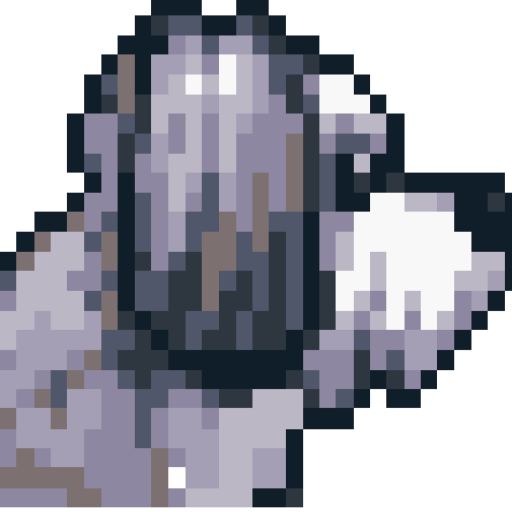
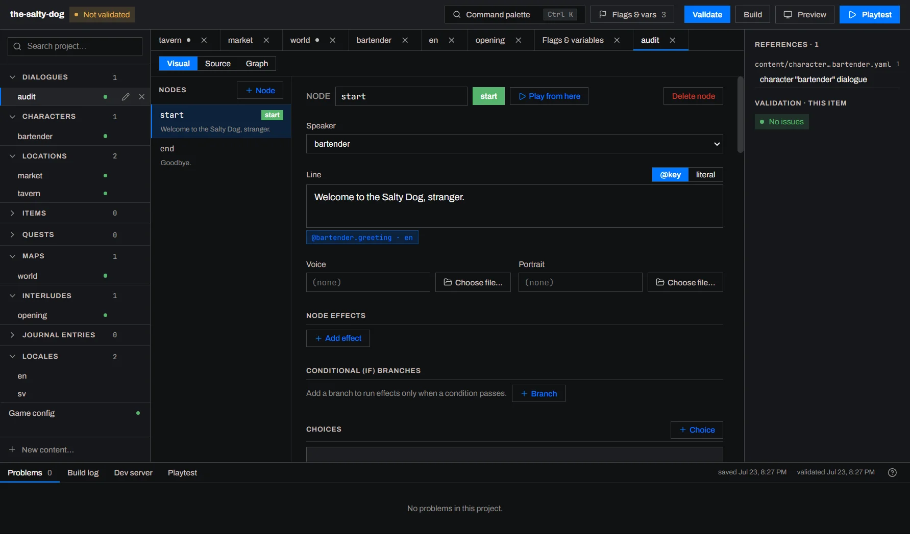

<p align="center">
  
</p>

<h1 align="center">Doodle Engine</h1>

<p align="center">A game engine for text adventure games, narrative adventures, and RPGs.</p>

<p align="center">
  <a href="https://github.com/katbella/doodle-engine/actions/workflows/ci.yml"></a>
  <a href="https://www.npmjs.com/package/@doodle-engine/core"></a>
  <a href="https://github.com/katbella/doodle-engine/releases"></a>
  <a href="LICENSE"></a>
</p>

---

## About

Doodle Engine is a game engine for text adventure games, narrative adventures, and RPGs. It focuses on dialogue, narrative flow, and world state rather than movement, combat, or pathfinding.

It is inspired by how the late-1990s and early-2000s Infinity Engine games (including _Baldur's Gate_, _Baldur's Gate II_, _Icewind Dale_, and _Planescape: Torment_) handled dialogue and scripting, but it is not tied to any specific ruleset or genre. The goal is to give writers and programmers a flexible foundation for story-heavy games.

The engine provides structured systems for dialogue, quests, inventory, characters, relationships, locations, journal entries, save/load, audio, video cutscenes, and localization.

---

## Doodle Studio

[Doodle Studio](https://doodleengine.dev/studio/) lets you create, edit, validate, and playtest Doodle Engine projects. It works directly with the same dialogue and YAML files used by the engine and CLI, and includes a [source editor](https://doodleengine.dev/studio/workspace/) when you want to work with the files directly.

[](https://doodleengine.dev/studio/)

Read the [Doodle Studio setup guide](https://doodleengine.dev/getting-started/installation/#doodle-studio-setup) or download Doodle Studio for Windows or macOS from [GitHub Releases](https://github.com/katbella/doodle-engine/releases).

---

## Building a Game

Doodle Studio and the project files work together. You can create and edit story content in Studio without programming as well as open the dialogue and YAML files directly. In the files, you change the game's React components and CSS to adjust what players see.

- Write branching dialogue with speakers, choices, conditions, and effects
- Create locations, characters, items, quests, maps, and journal entries
- Make choices and outcomes respond to inventory, quests, relationships, past decisions, and time of day
- Use dice rolls for skill checks and random outcomes
- Create narrative interludes for chapter screens, dream sequences, and story moments
- Localize your game by adding translation keys and language files
- Add images, music, sound effects, voice lines, and video
- See changes while the game is running
- Check for broken references and content errors
- Create a production build when the game is ready to publish

---

## Rendering and Platforms

The Doodle Engine core has no dependency on a UI framework. While Doodle includes a complete React renderer, a project can use any renderer that connects to the engine.

Games using the included renderer run in a web browser. They can be hosted on the web or wrapped for desktop and mobile.

For more, see [Customizing Doodle Engine](https://doodleengine.dev/guides/customizing-doodle-engine/).

---

## Quick Start

```bash
npx @doodle-engine/cli create my-game
cd my-game
npm install
npm run dev
```

---

## Packages

| Package                  | Description                                                      |
| ------------------------ | ---------------------------------------------------------------- |
| `@doodle-engine/core`    | Engine state, parsing, conditions, and effects                   |
| `@doodle-engine/react`   | React components and hooks                                       |
| `@doodle-engine/toolkit` | Project loading, validation, dev server, builds, and scaffolding |
| `@doodle-engine/cli`     | The `doodle` command line over the toolkit                       |
| `@doodle-engine/studio`  | Doodle Studio, distributed through GitHub Releases               |

---

## Documentation

Start with the [Doodle Studio walkthrough](https://doodleengine.dev/studio/) or [make your first game](https://doodleengine.dev/getting-started/your-first-game/). The complete documentation is at [doodleengine.dev](https://doodleengine.dev/).

---

## Development

Doodle Engine requires Node.js 24 or newer and uses Yarn 4.

```bash
corepack enable
yarn install --immutable
yarn build
yarn test
```

Run Doodle Studio in development mode with:

```bash
yarn studio
```

---

## Issues

If you run into a problem, start with [Reporting Issues and Feedback](https://doodleengine.dev/reference/reporting-issues/). It includes troubleshooting steps and explains what information to include in a report.

Report bugs and request features in the [issue tracker](https://github.com/katbella/doodle-engine/issues).

---

## License

Doodle Engine is licensed under the [MIT License](LICENSE).

Copyright &copy; Kat Bella.
